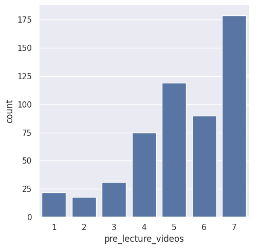
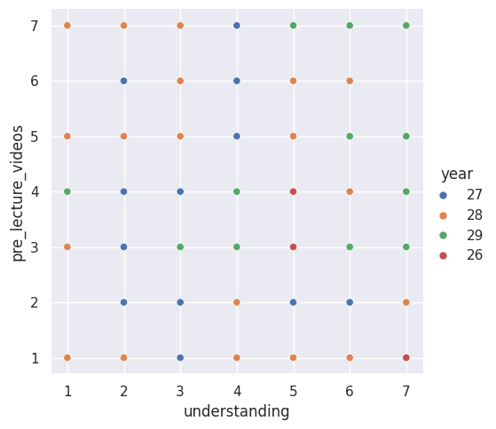
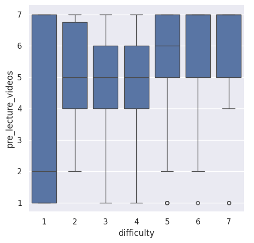

---
# Do not edit the text between these lines!
layout: default
---

# Data on Pre-Recorded Lectures and it's Effectiveness

<!-- This is a comment. Below, you'll see code for inserting an image. To make this image appear, update <custom-path>. To add an image, save it inside the imgs folder of this repository. -->

## The Data

The data consists of what I found when analyizing the surveys through code. It shows what students thought of the pre-recorded lectures and if it would help them in class.

According to these results, I prove that COMP 110 should include more pre-lecture videos so that students understand the concepts better. The first count plot showed that many students chose higher numbers from 1-7 (proving that there is a compiled understanding that it would be a nice addition). The scatterplot showed that more students that struggled in the class were on board for the idea of pre lecture videos. The last plot showed that people finding the class harder were as supportive of the video idea as the others were. This proves that the change would at least benefit the struggling students. There are also negatives to this idea. Creating the videos would take a while and be potentially annoying. Also, some students might feel like there is too much info. The next step would be to try the idea and then do another survey on if it helped, the usage, satisfaction, etc. This would complete the needed information to decide whether or not to fully commit to the idea.

